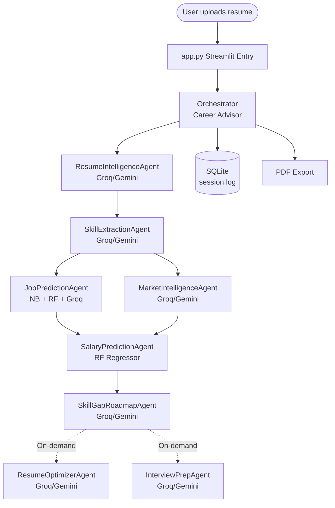
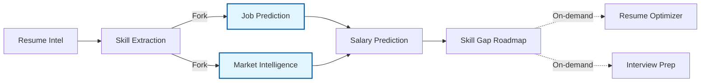
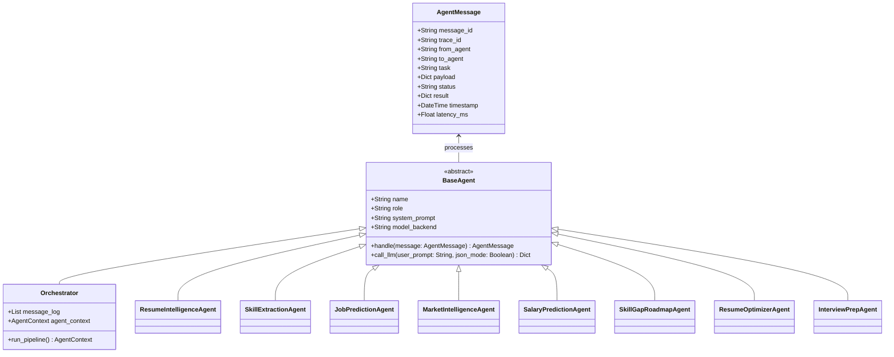
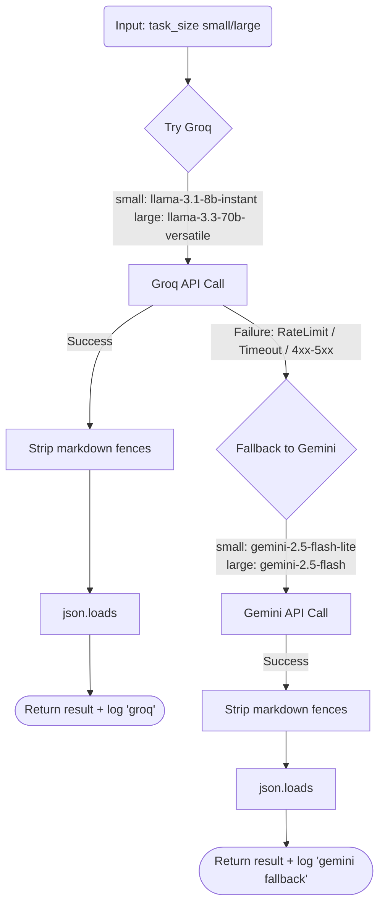
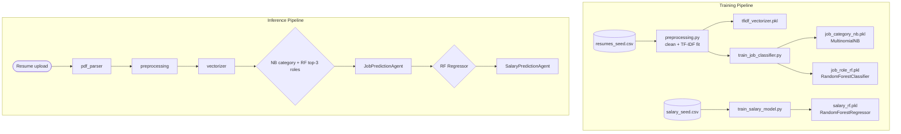

# 🎯 Smart Job Recommendation Agent
> **An AI-powered multi-agent pipeline for career guidance and salary prediction**

       

## 2. One-Liner Pitch
The Smart Job Recommendation Agent is an AI-driven, multi-agent orchestration platform designed to instantly analyze freshers' resumes, predict their optimal job roles, calculate data-backed salary ranges, and generate personalized 90-day learning roadmaps.

## 3. Problem Statement
Entering the job market as a fresher is incredibly daunting due to a lack of clear direction and mismatched expectations. Fresh graduates often struggle to identify which job roles actually align with their specific coursework and projects, leading to untargeted, ineffective applications. Furthermore, without industry experience, they have no realistic baseline for salary negotiations and lack visibility into the specific skill gaps keeping them from their dream roles. This agent solves these pain points by replacing guesswork with data-driven career analytics and actionable, step-by-step guidance.

## 4. Features Table

| Feature | Description |
|---|---|
| **Resume Upload** | Secure PDF parsing to extract raw text and metadata. |
| **Skill Extraction** | LLM-powered extraction of technical, soft, and domain skills. |
| **Job Role Prediction** | Dual-model (NB + RF) prediction of category and top 3 specific roles. |
| **Salary Prediction** | ML-driven estimation of fresher salary ranges (INR) with confidence bounds. |
| **Skill Gap Analysis** | Compares extracted skills against industry requirements for the predicted role. |
| **90-Day Roadmap** | Generates a week-by-week personalized learning and project schedule. |
| **Live Agent Activity Panel** | Real-time visibility into the multi-agent DAG execution and latencies. |
| **ATS Score + Keyword Gap** | Calculates resume ATS compatibility and suggests missing high-value keywords. |
| **Resume Bullet Rewriter** | Enhances weak resume bullet points using action verbs and STAR metrics. |
| **Cover Letter Generator** | Creates a tailored, professional cover letter for the targeted role. |
| **Interview Prep** | Generates role-specific behavioral and technical interview questions. |
| **Market Intelligence Dashboard** | Visualizes current market trends, demand, and standard requirements. |
| **Explainability Chart** | Shows Random Forest feature importances for transparent ML predictions. |
| **Confidence Scores** | Displays algorithmic confidence levels, flagging uncertain predictions. |
| **PDF Export** | Compiles all recommendations and roadmaps into a downloadable PDF report. |
| **Multi-Resume Batch Compare** | (Beta) Side-by-side comparison metrics for multiple resumes. |
| **Conversational Follow-up** | Interactive chat interface to ask questions about the generated report. |

## 5. System Architecture Diagram



## 6. Multi-Agent DAG Diagram



## 7. A2A Message Contract Diagram



## 8. LLM Router Flowchart



## 9. ML Pipeline Diagram



## 10. Folder Structure

```text
smart-job-recommendation-agent/
├── app.py                             # Main Streamlit application entry point
├── run_app.py                         # Local server runner wrapper
├── requirements.txt                   # Python package dependencies
├── .env.example                       # Template for environment variables
├── config/
│   └── settings.py                    # Global configuration and constants
├── agents/
│   ├── base_agent.py                  # Abstract base class for all agents
│   ├── orchestrator.py                # Pipeline manager and state controller
│   ├── resume_intelligence_agent.py   # Parses structural resume data
│   ├── skill_extraction_agent.py      # Extracts tech/soft/domain skills
│   ├── job_prediction_agent.py        # ML ensemble for role prediction
│   ├── market_intelligence_agent.py   # Analyzes market demand and trends
│   ├── salary_prediction_agent.py     # RF model for compensation ranges
│   ├── skill_gap_roadmap_agent.py     # Generates 90-day learning plans
│   ├── resume_optimizer_agent.py      # Rewrites bullets and ATS keywords
│   └── interview_prep_agent.py        # Generates role-specific questions
├── llm/
│   ├── groq_client.py                 # API client for Groq Llama models
│   ├── gemini_client.py               # API client for Google Gemini models
│   └── llm_router.py                  # Routing logic with fallback mechanism
├── ml/
│   ├── preprocessing.py               # Text cleaning and TF-IDF logic
│   ├── train_job_classifier.py        # Training script for job predictors
│   ├── train_salary_model.py          # Training script for salary regressor
│   ├── skills_taxonomy.csv            # Dictionary of canonical skills
│   └── models/                        # Serialized .pkl model files
├── data/
│   ├── resumes_seed.csv               # Synthetic training data for resumes
│   ├── salary_seed.csv                # Synthetic training data for salaries
│   └── seed_generator.py              # Script to generate synthetic datasets
├── pages/
│   ├── 1_Upload_Resume.py             # UI for PDF upload and processing
│   ├── 2_Agent_Pipeline.py            # UI for real-time agent monitoring
│   ├── 3_Results_Dashboard.py         # UI for predictions and metrics
│   ├── 4_Market_Intelligence.py       # UI for industry trends and demand
│   ├── 5_Career_Roadmap.py            # UI for 90-day learning schedules
│   ├── 6_Interview_Prep.py            # UI for prep questions and tips
│   └── 7_Settings.py                  # UI for API keys and configuration
├── utils/
│   ├── pdf_parser.py                  # PyMuPDF/pdfplumber extraction logic
│   ├── report_generator.py            # FPDF logic for final PDF export
│   ├── db.py                          # SQLite session and log management
│   └── ui.py                          # Reusable Streamlit UI components
└── build/
    ├── app.spec                       # PyInstaller specification file
    └── build_exe.bat                  # Windows batch script for compiling
```

## 11. Tech Stack Table

| Category | Library | Used For |
|---|---|---|
| **Data Processing** | `numpy`, `pandas` | Data manipulation, feature engineering, and tabular operations. |
| **Machine Learning** | `scikit-learn` | Core ML framework for predictive modeling. |
| |- `TfidfVectorizer` | Converting resume text into numerical feature vectors. |
| |- `MultinomialNB` | High-level job category classification. |
| |- `RandomForestClassifier` | Specific top-3 job role prediction. |
| |- `RandomForestRegressor` | Fresher salary range estimation. |
| **Model Serialization** | `joblib` | Saving and loading trained `.pkl` models efficiently. |
| **Visualization** | `matplotlib`, `seaborn`, `altair` | Explainability charts, confidence graphs, and UI metrics. |
| **LLM APIs** | `groq` | Lightning-fast primary inference using open-source Llama models. |
| | `google-generativeai` | Reliable fallback inference using Gemini Flash models. |
| **Document Parsing** | `pdfplumber`, `python-docx` | Extracting raw text and structural layout from uploaded resumes. |
| **Web Framework** | `streamlit` | Building the interactive frontend and multi-page application. |
| **PDF Generation** | `fpdf2` | Compiling the final comprehensive report into a downloadable PDF. |
| **Database** | `sqlite3` | Storing session states, agent message logs, and trace IDs. |
| **Environment** | `python-dotenv` | Loading local API keys securely. |
| **Utilities** | `uuid` | Generating unique trace IDs for pipeline sessions. |
| **Deployment** | `pyinstaller` | Bundling the entire application into a standalone Windows `.exe`. |

## 12. Agent Roster Table

| # | Agent Name | Backend | Responsibility | System Prompt Key Behavior |
|---|---|---|---|---|
| 1 | **Orchestrator** | Python / SQLite | Pipeline management | *Strictly enforce DAG execution order and persist all A2A messages to SQLite.* |
| 2 | **Resume Intelligence** | Groq / Gemini | Layout parsing | *Extract structural entities (Education, Projects) without hallucinating missing data.* |
| 3 | **Skill Extraction** | Groq / Gemini | Taxonomy matching | *Normalize found skills against the official taxonomy and discard generic buzzwords.* |
| 4 | **Job Prediction** | Scikit-Learn + LLM | Role synthesis | *Combine ML probabilities with semantic resume context to output the single best role.* |
| 5 | **Market Intelligence** | Groq / Gemini | Trend analysis | *Return current industry demand and growth metrics formatted strictly as JSON.* |
| 6 | **Salary Prediction** | Scikit-Learn | Comp estimation | *Calculate base salary applying location and experience penalties/multipliers.* |
| 7 | **Skill Gap Roadmap** | Groq / Gemini | Learning planning | *Generate a strictly week-by-week actionable plan bridging extracted and required skills.* |
| 8 | **Resume Optimizer** | Groq / Gemini | Bullet rewriting | *Rewrite bullets using the STAR method and inject missing high-value ATS keywords.* |
| 9 | **Interview Prep** | Groq / Gemini | Question generation | *Create 5 behavioral and 5 technical questions specific to the predicted job role.* |

## 13. Setup & Installation

Follow these exact steps to run the project locally from source:

**a) Prerequisites**
Ensure you have Python 3.11+ and Git installed on your system.

**b) Clone the repository**
```bash
git clone https://github.com/Saihemanth02/Smart-Job-Recommendation-Agent.git
cd Smart-Job-Recommendation-Agent
```

**c) Create and activate a virtual environment**
```bash
python -m venv venv
venv\Scripts\activate
```

**d) Install dependencies**
```bash
pip install -r requirements.txt
```

**e) Configure Environment Variables**
Copy the template file to create your local environment file:
```bash
copy .env.example .env
```
Open `.env` and fill in your `GROQ_API_KEY` and `GEMINI_API_KEY`.

**f) Train the Machine Learning Models**
*(Crucial: You MUST run these scripts before starting the web app to generate the `.pkl` files)*
```bash
python ml/train_job_classifier.py
python ml/train_salary_model.py
```

**g) Run the Application**
```bash
streamlit run app.py
```

## 14. How to Build the .EXE

To distribute the app as a standalone Windows executable without requiring users to install Python:

**a) Ensure models are trained**
Verify that all `.pkl` files exist in `ml/models/` by running step (f) from the installation guide.

**b) Run the build script**
Execute the provided batch script from the project root:
```bash
build\build_exe.bat
```

**c) Output Location**
The compiled application will be generated at `dist\run.exe`.

**d) ⚠️ Known Issue: Streamlit Blank Tab**
If running the `.exe` opens a browser tab that remains completely blank, PyInstaller missed the Streamlit static assets. To fix this, manually copy the folder:
`venv\Lib\site-packages\streamlit\static` 
INTO 
`dist\smart_job_agent\streamlit\` (or equivalent extracted temporary directory).

**e) Dependency Warning**
Always pin the Streamlit version in `requirements.txt`. Never run `pip install -U streamlit` without completely re-testing the PyInstaller build process, as Streamlit updates frequently break PyInstaller hooks.

## 15. Environment Variables

| Variable | Required | Description |
|---|---|---|
| `GROQ_API_KEY` | Yes | Primary high-speed inference key. Get from [console.groq.com](https://console.groq.com) |
| `GEMINI_API_KEY` | Yes | Fallback inference key. Get from [aistudio.google.com](https://aistudio.google.com) |

## 16. Pages Overview

| Page File | Route | What it does |
|---|---|---|
| `1_Upload_Resume.py` | `/Upload_Resume` | Initial entry point. Handles PDF upload, basic validation, and kicks off the Orchestrator pipeline. |
| `2_Agent_Pipeline.py` | `/Agent_Pipeline` | Real-time observability dashboard showing the live SQLite message log as agents communicate. |
| `3_Results_Dashboard.py` | `/Results_Dashboard` | The primary output view showing extracted skills, the predicted job role, and the salary range estimate. |
| `4_Market_Intelligence.py` | `/Market_Intelligence` | Displays broader industry context, hiring demand, and required baseline skills for the target role. |
| `5_Career_Roadmap.py` | `/Career_Roadmap` | Renders the generated 90-day learning schedule and highlights the specific skill gaps identified. |
| `6_Interview_Prep.py` | `/Interview_Prep` | Provides targeted behavioral and technical practice questions based on the candidate's weaknesses. |
| `7_Settings.py` | `/Settings` | Configuration hub for managing API keys, viewing database trace IDs, and loading historical sessions. |

## 17. How the Agent Pipeline Works

When a fresher uploads their resume, the Orchestrator assigns a unique trace ID and logs every inter-agent communication to an SQLite database. The PDF is parsed into raw text and handed to the Resume Intelligence Agent for structural breakdown. The Skill Extraction Agent then filters this data against an industry taxonomy to identify verified technical and soft skills. 

This clean skill profile triggers a parallel fork: the Job Prediction Agent utilizes Scikit-Learn models and LLM synthesis to determine the optimal job role, while the Market Intelligence Agent pulls current industry demand. These outputs merge at the Salary Prediction Agent, which calculates a realistic starting compensation range using a Random Forest Regressor. 

Finally, the Skill Gap Roadmap Agent compares the user's current skills against the predicted role's requirements, generating a week-by-week learning plan. The user can view this entire execution in real-time via the Agent Activity Panel, and ultimately download a comprehensive PDF report. On-demand tools for resume optimization and interview prep are also available post-pipeline.

## 18. Confidence & Explainability

Transparency is critical when providing career advice. Every Machine Learning prediction in this platform is accompanied by a confidence score (e.g., "78% confidence in Data Analyst role"). Furthermore, the application features an Explainability Chart that renders the Random Forest feature importances as a bar chart, allowing the user to see exactly *which* skills drove their job and salary predictions. Low-confidence predictions (under 50%) are never hidden; instead, they are flagged with warnings, advising the user that their resume may lack sufficient keywords or focus.

## 19. Screenshots Placeholder

| Upload Page | Agent Activity Panel |
|:---:|:---:|
|  <br/> *Resume upload and parsing interface* |  <br/> *Real-time SQLite message log monitoring* |

| Results Dashboard | Market Intelligence |
|:---:|:---:|
|  <br/> *ML predictions and skill extraction results* |  <br/> *Industry demand and requirement visualizations* |

## 20. Known Limitations

* Synthetic seed data (600-1000 rows) → predictions will significantly improve when replaced with real-world, localized HR data.
* Salary figures are strict INR estimates calibrated specifically for the Indian fresher market; global applications require model retraining.
* The PyInstaller `.exe` may occasionally require a manual static folder fix on certain Windows builds due to Streamlit asset packaging quirks.
* The Groq free tier imposes strict rate limits — heavy batch processing or concurrent users may frequently trigger the Gemini fallback mechanism.

## 21. Roadmap (Future Improvements)

* Real job posting scraper (LinkedIn/Naukri integrations) to replace synthetic seed data with live market demands.
* Cloud deployment configurations (Streamlit Cloud / Render) to transition from local `.exe` to SaaS architecture.
* User accounts and historical progression tracking (replacing local SQLite with hosted Supabase).
* Resume version comparison, allowing users to upload updated resumes and measure ATS score improvements.
* Mobile-responsive UI redesign for better accessibility on smaller devices.

## 22. License

This project is licensed under the MIT License - see the LICENSE file for details.

## 23. Author

**Sai Hemanth Kumar**  
MCA — Gayatri Vidya Parishad College of Engineering  
GitHub: [github.com/Saihemanth02](https://github.com/Saihemanth02)  
LinkedIn: [linkedin.com/in/saihemanth02](https://linkedin.com/in/saihemanth02)
